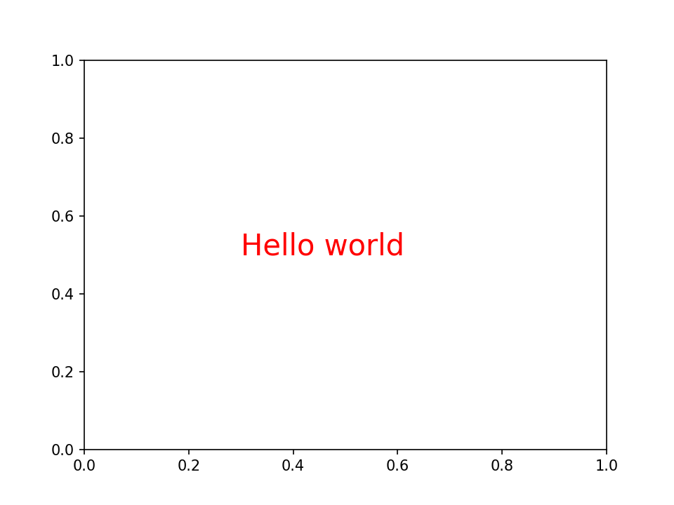

This document explains everything you need to know to create a theme in matplotlib, and optionally how to add it to **`morethemes`**.

<br>

## rcParams

In matplotlib, themes are made via something called `rcParams`. It's similar to a global parameter configuration: once applied, it will be set for all charts.

Let's see how this works. First we import pyplot from matplotlib.

```python
import matplotlib.pyplot as plt
```

For example, I can change the default line widths from matplotlib lines from 1 to 5.

By default it's 1, and it looks like this:

```python
import matplotlib.pyplot as plt

fig, ax = plt.subplots()
ax.plot([1, 2, 3])
plt.show()
```


We can then set the default line width to 5.

```python hl_lines="3"
import matplotlib.pyplot as plt

plt.rcParams["lines.linewidth"] = 5

fig, ax = plt.subplots()
ax.plot([1, 2, 3])
plt.show()
```


I can also change the default text color from `"black"` to `"red"`.

```python hl_lines="3"
import matplotlib.pyplot as plt

plt.rcParams["text.color"] = "red"

fig, ax = plt.subplots()
ax.text(x=0.3, y=0.5, s="Hello world", size=20)
plt.show()
```



There are more than **300 other parameters** like this that we can change. Yes it's a lot, but don't worry. We only need just a few of themes to make great themes.

<br>

## How **`morethemes`** work

Under the hood, themes from **`morethemes`** are applied by calling `plt.rcParams` many times.

For example, when I set the theme to `darker`, it will call all parameters of this theme and pass them to `plt.rcParams`:

```python
import morethemes as mt
mt.set_theme("darker")
```

<br>

## Create a theme

Before adding your theme to **`morethemes`**, it's important that you first make your theme and ensure you like it.

For this, you'll need to do some trials and errors until you're satisfied. An example of a theme could be something like:

```python
import matplotlib.pyplot as plt

# Example of a theme. Change it with your own rcParams.
plt.rcParams["figure.facecolor"] = "#282828"
plt.rcParams["axes.edgecolor"] = "#eeeeee"
plt.rcParams["xtick.color"] = "#eeeeee"
plt.rcParams["axes.spines.right"] = False
```

But how do you visualize what it looks like in practice? You need to preview it in different scenario.

<br>

## Preview a theme

In my opinion, the easiest way to preview a theme is to use the `mt.preview_theme()` function. It will make many different charts and you'll easily be able to view how your theme currently looks like.

```python
import matplotlib.pyplot as plt
import morethemes as mt

# Example of a theme. Change it with your own rcParams.
plt.rcParams["figure.facecolor"] = "#282828"
plt.rcParams["axes.edgecolor"] = "#eeeeee"
plt.rcParams["xtick.color"] = "#eeeeee"
plt.rcParams["axes.spines.right"] = False

mt.preview_theme()
```

<br>

## Available parameters

We said before that there was more than 300 parameters to custom. Here are a few tips to know which one you might want to custom.

To get all possible parameters and their default values, run:

```python
import matplotlib.pyplot as plt
plt.rcParams.keys()
```

### Colors

Colors is the main thing that changes in a theme. Here you'll find every param name that you might need:

```python
plt.rcParams["axes.facecolor"] = "black"     # Axes color
plt.rcParams["figure.facecolor"] = "black"   # Figure color
plt.rcParams["axes.labelcolor"] = "grey"     # Label color
plt.rcParams["axes.edgecolor"] = "grey"      # Spines color
plt.rcParams["xtick.color"] = "grey"         # x tick color
plt.rcParams["ytick.color"] = "grey"         # y tick color
plt.rcParams["text.color"] = "white"         # Text color
```

By default, matplotlib charts will be <span style="color: #1f77b4;">**blue**</span>. But if your chart has 2 colors, by default, the colors will be <span style="color: #1f77b4;">**blue**</span> and <span style="color: #ff7f0e;">**orange**</span>. If there are 3, the colors will be <span style="color: #1f77b4;">**blue**</span>, <span style="color: #ff7f0e;">**orange**</span> and <span style="color: #2ca02c;">**green**</span>. This will continue with 7 other colors.

This is called a `prop_cycle`. Changing this parameter will also to change default colors in chart elements such as lines or bars. For this we need to import `cycler` (already installed with matplotlib), and use the following syntax:

```python
from cycler import cycler
plt.rcParams["axes.prop_cycle"] = cycler(
   "color", ["#FED789", "#A4BED5", "#72874E", "#023743", "#476F84", "#453947"]
)
```

### Spines

You can control the appearance of spines around matplotlib Axes with the following parameters:

```python
plt.rcParams["axes.spines.top"] = False       # Remove top spine
plt.rcParams["axes.spines.bottom"] = False    # Remove bottom spine
plt.rcParams["axes.spines.right"] = False     # Remove right spine
plt.rcParams["axes.spines.left"] = False      # Remove left spine
plt.rcParams["axes.edgecolor"] = "#eeeeee"    # Spine color
plt.rcParams["axes.linewidth"] = 1.5          # Spine width
```

### Fonts

It is highly recommended to use a specific font for a theme, as it plays a major role in the brand image. To do this, you need to follow a few steps before you can add a new font.

- add the desired font file to `morethemes/fonts/font-name.ttf`.
- use this code to set the font:

```python
plt.rcParams['font.family'] = mt.fonts.set_family_from_file("font-name.ttf")
```

- add the font licence to `morethemes/fonts/LICENSE` (only do this once you've found the right font for your theme).

### Others

As there are many other things to customise here, **take a look at what other themes are doing** in [`morethemes/themes.py`](https://github.com/JosephBARBIERDARNAL/morethemes/blob/main/morethemes/themes.py).

<br>

## Add your theme to **`morethemes`**

Once your theme is nice, you can follow the [contributing guide](../../contributing) to help you implement this new theme.

<br><br>
